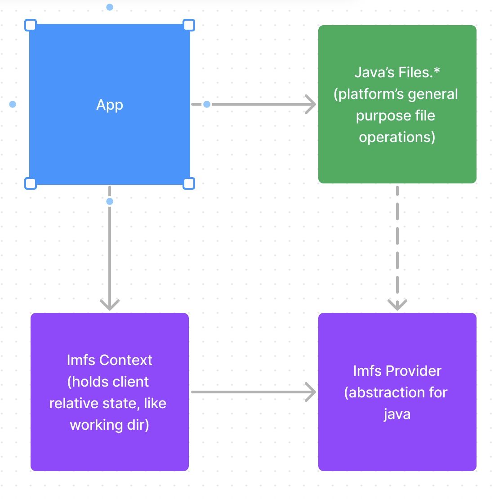

# Material Security Take-home Interview: In-Memory Filesystem

## Overview

### Prompt

> Build an in-memory filesystem! This is a simplified file system that supports both files and directories. You don’t have to work with any actual files, everything will just be contained in-memory.
>
> Write functions that correspond to familiar file system commands. We only care about the capabilities, so you may choose to combine multiple capabilities into one function, or even split up one capability amongst multiple functions (up to you). You can leave comments and TODOs if there are ideas or issues you want to discuss or point out, but don’t have time to implement/fix, or aren’t quite sure how.

### Proposal

Build the project using Codespaces and Java to optimize for accessibility by reviewers.
Since we are using Java, integrating with NIO will get us the richest possible implementation.
See [Decision Records](#decision-records) for details.

### Results

**Implementation based on FileSystemProvider has proven to be a success and a lot of fun!**

Once all of the [functional requirements](#functional-requirements) were met,
many of the extension capabilities were also usable, or added by simple incremental changes
(eg, streams, paths, tree walks, move, and copy).
And some features come almost for free, like importing files from the OS.

# Verifying the requirements

1. **Try Out Codespaces: Java**

   - Follow these steps to open this repo in Codespaces:
   - Click the **Code** drop-down menu.
   - Click on the **Codespaces** tab.
   - Click **Create Codespace on main**.
   - For more info, check out the [GitHub documentation](https://docs.github.com/en/free-pro-team@latest/github/developing-online-with-codespaces/creating-a-codespace#creating-a-codespace).
   - Or just treat it like a Java repo.

2. **Run the Tests:**

   - The core functional scenarios are covered in [ImfsContextTest](src/test/java/com/imfs/ImfsContextTest.java).
   - Open the file and use the right-click `Run Test` options.
   - Add a breakpoint.
   - Click the `Debug Test` in the Code Lens above the function and watch it hit any breakpoints.
   - Once the breakpoint is hit, try hovering over variables, examining locals, and more.

3. **Explore the code:**

   - Open [ImfsContext](src/main/java/com/imfs/ImfsContext.java) to see bash-like functionality (ls, mv, cp, ...).
   - Open [ImfProvider](src/main/java/com/imfs/ImfsProvider.java) for core behavior.
   - Open [ImfsFileSystem](src/main/java/com/imfs/ImfsFileSystem.java) to see the storage.

# Requirements

Copied from the PDF.

## Structural parameters

- [x] Choose a language of your choice (excluding bash, Haskell, or scala).
  - **_>> Java selected._**
- [x] Feel free to use small libraries where appropriate instead of reinventing the wheel.
  - **_>> Added Lombok for immutable POJOs._**
- [x] Feel free to look things up or use other reference material as you would when working
      normally.
  - **_>> Mostly Java docs for SPI and Google, starting to use copilot._**
- [x] Please make this look as close to real production code as you would submit for code review
      (e.g feel free to refactor aggressively, use helper functions, etc)
  - **_>> Depends on cultural norms._**
- [x] Submit your code via Git Hub.
  - **_>> See [repo](https://github.com/ZekeAranyLucas/material-takehome)._**
- [x] Please include a README that includes how to get your code running/tested.
  - **_>> Currently reading._**

## Functional requirements

- [x] Change the current working directory. The working directory begins at '/'. You may traverse to a child directory or the parent.
- [x] Get the current working directory. Returns the current working directory's path from the root to the console. Example: ‘/school/homework’
- [x] Create a new directory. The current working directory is the parent.
- [x] Get the directory contents: Returns the children of the current working directory.
      Example: [‘math’, ‘history’, ‘Spanish’]
- [x] Remove a directory. The target directory must be among the current working directory’s
      children.
- [x] Create a new file: Create a new empty file in the current working directory.
- [x] Write file contents: Writes the specified contents to a file in the current working
      directory. All file contents will fit into memory.
- [x] Get file contents: Returns the content of a file in the current working directory.
- [x] Move a file: Move an existing file in the current working directory to a new location (in
      the same directory).
- [x] Find a file/directory: Given a filename, find all the files and directories within the current
      working directory that have exactly that name.
- [x] throw when trying to delete non-empty directories.
- [x] Interface with Java's `Files.\*` APIs.

## Extensions

### [x] From Zeke

- [x] See [importFiles](src/main/java/com/imfs/ImfsContext.java) to make a copy of the local file system.
- [x] See [grepTree](src/main/java/com/imfs/ImfsContext.java) to search the in-memory tree.
      Combines tree walking and file reading into a single flattened stream.

### [x] Move and copy

- [x] You can move or copy files and directories.
- [x] Support merging the contents of two directories when moving or copying one into
      the other.
- [x] Handle name collisions in some way (e.g. auto renaming files, merging
      directories.) **_>> See [mergeDirs](src/main/java/com/imfs/ImfsContext.java)._**

### [x] Operations on paths

- [x] When doing basic operations (changing the current working directory, creating or moving files or folders, etc), you can use absolute paths instead of only operating on objects in the current working directory. **>> ImfsContext resolves everything to absolute paths anyway.**
- [ ] You can use relative paths (relative to the current working directory) as well, including the special “..” path that refers to the parent directory. **_>> Some relative operations work._**
- [ ] When creating or moving items to a new path, you can choose to automatically create any intermediate directories on the path that don’t exist yet.
      **_>> Files.createDirectories is the right way to do this but it requires a relative Path (in the TODO section)._**

### [x] Walk a subtree

**_>> Traversal is supported explicitly via NIO's [`walk() and walkTree()`](https://docs.oracle.com/javase/8/docs/api/java/nio/file/Files.html#walk-java.nio.file.Path-java.nio.file.FileVisitOption...-)._**

- [x] You can walk through all the recursive contents of a directory, invoking a passed-in function on each child directory/file.
- [x] While walking, the passed-in function can arbitrarily choose not to recurse into certain subdirectories.
- [x] Use this to implement some recursive operations. For example, finding the first file in a subtree whose name matches a regex.

### [ ] Symlinks and hardlinks

**_>> Skipping this one._**

- [ ] Add symlinks. Symlinks contain a path referencing the file or directory they represent. Reading a symlink’s file/directory contents should have the same results as reading the contents of the item it references instead.
- [ ] Add hardlinks. Hardlinks of a file/directory all point to the same file contents or directory children even if the original file/directory moves to a new location.

### [ ] Permissions and multiple users

**_>> Skipping this one._**

- [ ] You can set read/write permissions on files and directories
- [ ] There are multiple users, who can have different permissions. You can switch
      between them (but switching doesn’t need to require permissions, it’s just for
      testing.)
- [ ] Users can be in groups, and the groups have different permissions that users inherit.

### [x] Stream for file contents

- [x] Reading a file can be done in chunks or as a stream, not just all contents at once. **_>> This is the way._**
- [x] You can also write to a file in chunks or a stream. **_>> This is the way._**
- [x] You can have one writer and multiple readers of a file at the same time. **_>> Works for multiple readers, but simultaneous read/write is undefined._**
- [x] You can continue reading/writing from a file even if it gets moved to a different
      path before you’re done. **_>> Works for read, but write stores in the old location (no data loss)._**
- [ ] You can read and write starting from any part of a file and also jump to a different
      part (random access) **_>> Works for read, not for write_**

## Risks and open issues

- [ ] **The compiler compliance specified is 11 but a JRE 17 is used**. The codespaces template specified JavaSE-11, but the default OpenJDK is on 17. Defer doing an upgrade for now.
- [ ] **TODO / UnsupportedOperationException** - There are over 40 unimplemented stubs.
      Most would be required to complete the requirements for integration with NIO Files API. However, the documentation indicates that not all of them are expected for every implementation.
  - [ ] **Spaces are unsupported in ImfsPath** - This would be fixed as part of finishing relative path support.
  - [ ] **Paths have lots of edge cases** - Adding code coverage and detailed unit testing for path manipulation is desirable.
- [ ] **Missing performance scenarios** - What are we optimizing for? Performance is about tradeoffs so making some
      decisions would depend on prioritizing use case scenarios.
  - [ ] **Root enumerations are expensive** because they scan the full TreeMap and do a filter.
        Might need a cache or new data structure if this is a problem.
  - [ ] **Files are stored in contiguous byte arrays.** Humongous files (>16MB) could cause weird fragmentation issues,
        especially since these allocations are likely to be long-lived. Could use a fancier allocation scheme like a chain of blocks.
- [ ] **How important is concurrency?** For simple scenarios wrapping TreeMap with Collections.synchronizedSortedMap might be enough.
      Switching to an in-memory DB like H2 or SQLite is also an option.

# Architecture

[See FigJam](https://www.figma.com/file/DNAxxIspJKGBQUapbo3fhG/Untitled?type=whiteboard&node-id=1%3A2&t=hDWt2koQ75jWMFpJ-1)

## Decision records

### D1: Use Codespaces

This is an opportunity to experiment. The hypothesis is that Codespaces will it easier to share the code
and execution environment with reviewers at Material so that it's less effort to dig in and evaluate the specifics of the project.

### D2: Implement Java's FileSystemProvider (FSP)

Java has defined how to integrate as a file system. The hypothesis is that [FSP is a good abstraction](https://docs.oracle.com/javase/8/docs/technotes/guides/io/fsp/filesystemprovider.html) for
representing an in-memory file system, and will also allow richer scenarios pretty quickly through
the commonly used and documented [Files API](https://docs.oracle.com/javase/7/docs/api/java/nio/file/Files.html).

### D3: Separate relative state into a context object

State like the working directory is relative to the caller and not global to the storage. The hypothesis is that
this state is better kept explicitly under the caller's control instead of process global (like env vars)or thread-local so that we avoid future problems with multiple simultaneous callers.

NOTE: Java's implementation of working dir for the default file system is not fully mutable,
so also does not meet the requirements of this exercise.

### D4: Use Materialized paths as storage

Materialized paths are where each row contains the full path as the primary key
instead of doing something with graphs or nested objects. The hypothesis is that understanding and debugging
will be simpler than the other options. It makes it pretty easy to trade between different storage options like ArrayList, hashmaps, or even SQL tables.

### D5: Support arbitrary volumes

While the basic requirements are for a single global in-memory store, it's trivial to support multiple.
The hypothesis is that it will make it easier to do isolated testing, and maybe try alternate storage options.
The first alternative is "\*Test" namespaces will start with child directories: `[‘math’, ‘history’, ‘Spanish’]`.

### D6: Don't be pedantic about unit testing

Developer testing can include all kinds of test variations. The hypothesis is that strict isolation won't
help iron out kinks in the design, but could slow down development by forcing mocks for singletons, etc.

### D7: Blob storage for files has no limits

Committing the file blobs as byte arrays means the system can become unpredictable, so this is risky.
The hypothesis is that we simplify the implementation to meet the functional requirements,
but we will need to revisit limits and the implementation before the general purpose release.
once the scenarios are understood, then limits will need to be tested and enforced.

### D8: defer support for relative paths

Relative paths are required to use some `Files.*` APIs (like [createDirectories](https://docs.oracle.com/javase/8/docs/api/java/nio/file/Files.html#createDirectories-java.nio.file.Path-java.nio.file.attribute.FileAttribute...-)).
Hypothesis the leverage for doing this right now is weak, and the time is better spent on other scenarios. Relative paths are also one of the suggested extensions. The prototype code is in the branch fix-mkdirs-and-relative-paths.

### D9: Upgrade TreeMap as the storage index

ArrayList and HashMap were easy to use, but bad for any child enumerations, since they
required going through the entire store for any enumeration. The hypothesis is
that TreeMap will be good enough until we understand the usage patterns for put/get/enum/io.

- Checking for empty directories (enum kids) is now reasonably cheap.
- put/get is still faster than ArrayList, but slower than HashMap.
- enumerating the root still requires iterating over the full set and filtering.

Most likely the next step in indexes would be to use H2, SQLite, or another in-memory RDB.
That would make these queries possible: `SELECT * WHERE path LIKE 'foo/%' and path NOT LIKE 'foo/%/%'` or for the root `SELECT * WHERE path LIKE '%' and path NOT LIKE '%/%'`
since root enums are the worst case scenario.

Or switching to something like Nested Set or Adjacency List.

## License

Licensed under the MIT License. See LICENSE in the project root for license information.
